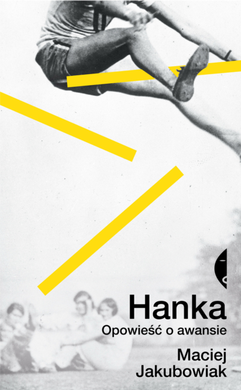
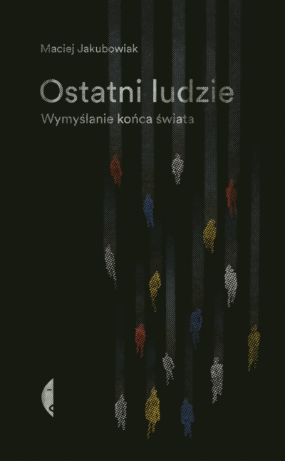
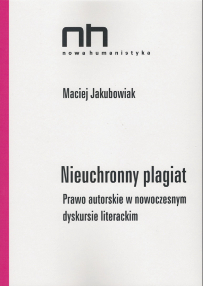
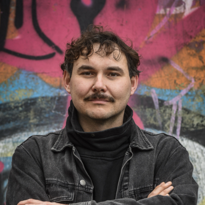

[najnowsze teksty](najnowsze.md) – [kontakt](kontakt.md) – [biogram i zdjęcie](bio.md)

## Napisałem trzy książki

**[„Hanka. Opowieść o awansie"](https://czarne.com.pl/katalog/ksiazki/hanka)** (Wydawnictwo Czarne, 2024)

**[„Ostatni ludzie. Wymyślanie końca świata"](https://czarne.com.pl/katalog/ksiazki/ostatni-ludzie)** (Wydawnictwo Czarne, 2021)

**[„Nieuchronny plagiat"](http://wydawnictwo.ibl.waw.pl/serie-wydawnicze/nowa-humanistyka/nieuchronny-plagiat?vid=2)** (Wydawnictwo IBL PAN, 2017)

## Opublikowałem też

**ponad 200 tekstów** (esejów, recenzji, wywiadów) poświęconych kulturze współczesnej w czasopismach: „Dwutygodnik", „Tygodnik Powszechny", „Pismo", „Książki. Magazyn do czytania" i innych. To niektóre z nich (a najnowsze [można znaleźć tu](najnowsze.md)):

### [Eseistyczny cykl „Zajawka albo jak pokochałem hokej” | Dwutygodnik](https://www.dwutygodnik.com/cykl/88-zajawka-albo-jak-pokochalem-hokej.html)

> Nic tego nie zapowiadało, po prostu się stało. Pewnego dnia pokochałem hokej. I wszystko, co się z nim wiąże: ślizgawki, łyżwy, sprzęt, mecze lokalnego klubu, transmisje z zagranicy, w końcu sam zacząłem trenować. Zakochałem się. Miałem swoje sprawy, pracę, rodzinę, książkę do napisania, i jasne, robiłem swoje, ale kręcił mnie tylko hokej. Do obiadu oglądałem filmiki treningowe, wieczorami transmisje meczów, trzy albo cztery razy w tygodniu chodziłem na lodowisko i uczyłem się przeplatanki tyłem. Przepadłem.

### [Ali Smith jest szybka | Miesięcznik ZNAK](https://www.miesiecznik.znak.com.pl/ali-smith-jest-szybka/)

> Akceptacja dla emocjonalnych komplikacji sprawia, że Ali Smith jest pisarką nie tylko ciekawą czy intrygującą, ale po prostu wielką. Nie boi się konfrontować postaci ze złożonością świata, pozwala im myśleć o polityce, doświadczać bezsilności, wygłaszać opinie piękne i kompletnie głupie.

### [„Dosyć tego nowego" | Dwutygodnik](https://www.dwutygodnik.com/artykul/11075-dosyc-tego-nowego.html)

> Jeśli mamy dziś kłopot z przymusem nowości, to dlatego, że nie pozwala nam się powtarzać. Tymczasem problemy, z którymi zderzamy się w ostatnich latach, uparcie nie chcą być innowacyjne

### [„Wielki zderzacz poglądów” | Tygodnik Powszechny](https://www.tygodnikpowszechny.pl/dosc-debat-ida-inby-184157)

> Wyobrażenie o naszej jednostkowej wyjątkowości jest nieustannie podmywane. A jeśli wcale nie jesteśmy wyjątkowi? Co w tym złego?

### [„Koniec z akademią” | Dwutygodnik](https://www.dwutygodnik.com/artykul/9776-koniec-z-akademia.html)

> Spróbuję tu opowiedzieć i zrozumieć, jak to się stało, że moje największe, pielęgnowane przez długi czas marzenie -- akademia -- tak gwałtownie i tak kompletnie, dokładnie wtedy, kiedy było na wyciągnięcie ręki, straciło swoją atrakcyjność

### [„Koniec epoki dystansu” | Tygodnik Powszechny](https://www.tygodnikpowszechny.pl/koniec-epoki-dystansu-166948)

> Po końcu epoki dystansu dyskusje o świecie muszą się skomplikować. Kiedy nie można już fantazjować o bezpiecznej pozycji, na którą można by się wycofać, w spory trzeba wkładać więcej energii.

## Na co dzień

**pracuję jako redaktor** magazynu o kulturze [„Dwutygodnik"](https://www.dwutygodnik.com). Zajmuję się w nim literaturą, mediami i ekologią.

## Za swoją pracę

**zdobyłem kilka nagród, wyróżnień, nominacji oraz stypendiów**. Oto one:

- Nominacja do nagrody Grand Press w kategorii „Publicystyka" za esej „Koniec z akademią" -- 2022
- Stypendium Twórcze Miasta Krakowa -- na projekt książki „Hanka" -- 2022
- Nominacja do Nagrody-Stypendium im. Stanisława Barańczaka za „Ostatnich ludzi" -- 2022
- Nagroda Krakowska Książka Miesiąca dla „Ostatnich ludzi" -- 2022
- Nagroda im. Adama Włodka -- na projekt książki „Hanka" -- 2022
- Wyszehradzka Rezydencja Literacka -- 2022
- Nominacja do nagrody Odkrycia Empiku za „Ostatnich ludzi" -- 2022
- Wirtualna Rezydencja Literacka w Melbourne Mieście Literatury UNESCO -- 2021
- Nagroda Krakowa Miasta Literatury UNESCO -- stypendium na prace nad książką „Ostatni ludzie" - 2020

## Z wykształcenia

jestem literaturoznawcą. W 2017 roku obroniłem doktorat na Wydziale Polonistyki Uniwersytetu Jagiellońskiego. [Od 2021 roku nie jestem związany z akademią](https://www.dwutygodnik.com/artykul/9776-koniec-z-akademia.html).

## Jacek Taran zrobił mi kiedyś takieś zdjęcie

